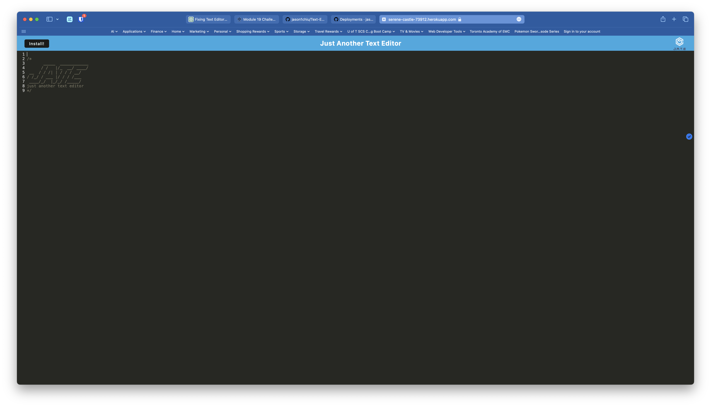

# WriteMate: A Progressive Web App Text Editor with Offline Capabilities
## License
 The application is covered under the [MIT License](https://opensource.org/licenses/MIT).
## Description
Your motivation is to develop a reliable and efficient text editor web application that allows you to create, save, and retrieve notes or code snippets, with or without an internet connection, using modern web technologies and best practices. I built this project to provide developers with a reliable, offline-capable text editor that allows them to create, store, and retrieve notes or code snippets effortlessly for later use, ensuring seamless functionality and a smooth user experience. Our text editor web application allows developers to create, save, and retrieve notes or code snippets seamlessly, with or without an internet connection, ensuring that they have consistent access to their work through a progressive web app that functions smoothly across different browsers. I learned how to create a responsive text editor web application with offline capabilities using a client-server folder structure, webpack, IndexedDB, and Workbox, while deploying the application on Heroku.
## Table of Contents:
1. [Installation](#installation)
2. [Usage](#usage)
3. [Credits](#credits)
4. [Features](#features)
5. [Contribute](#contribute)
6. [Test](#test)
7. [Questions](#questions)

## Installation
1. Visit the following [link](https://serene-castle-73912.herokuapp.com).
2. On the upper left corner, click on Install! to download the Chrome app.

## Usage
Our text editor supports next-gen JavaScript and allows you to create, edit, and save notes or code snippets. As you enter content into the text editor and click off the DOM window, the application will automatically save your content using IndexedDB. If you close the application and reopen it, you'll find that your content has been retrieved from the IndexedDB storage. You can also install the web application on your desktop by clicking the 'Install' button within the app. This will create a shortcut icon that you can use to easily access the text editor. The application is built with progressive enhancement, utilizing a registered service worker with Workbox to cache static assets and subsequent pages for improved performance and offline access.

## Credits
### Collaborators
None
### Third-Party
1. [Express.js](https://expressjs.com)
2. [Node.js](https://nodejs.org/en)
3. [Webpack](https://www.npmjs.com/package/webpack)
4. [Webpack CLI](https://www.npmjs.com/package/webpack-cli)
5. [Babel](https://babeljs.io)
6. [Webpack CSS Loader](https://webpack.js.org/loaders/css-loader/)
7. [Babel-Loader](https://www.npmjs.com/package/babel-loader)
8. [HTMLWebpackPlugin](https://webpack.js.org/plugins/html-webpack-plugin/)
9. [Http-Server](https://www.npmjs.com/package/http-server)
10. [Style-Loader](https://webpack.js.org/loaders/style-loader/)
11. [DevServer](https://webpack.js.org/configuration/dev-server/)
12. [webpack-pwa-manifest](https://www.npmjs.com/package/webpack-pwa-manifest)
13. [workbox-webpack-plugin](https://www.npmjs.com/package/workbox-webpack-plugin)
14. [idb](https://github.com/jakearchibald/idb)

### Tutorials
None

## Features
None

## Contribute
1. Fork the repository.
2. Create a new branch.
3. Write and test your code.
4. Commit your changes with detailed comments.
5. Push your changes to GitHub.
6. Open a pull request.
7. Merge your pull request.

## Test

## Questions
If you like to see my other projects, my GitHub username is [jason1chiu](https://github.com/jason1chiu) and my GitHub profile is [https://github.com/jason1chiu](https://github.com/jason1chiu). Furthermore you may email me at jasonchiu2@yahoo.com if you have any additional questions.
